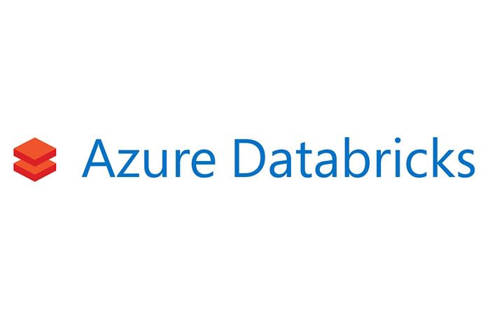
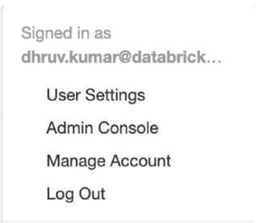
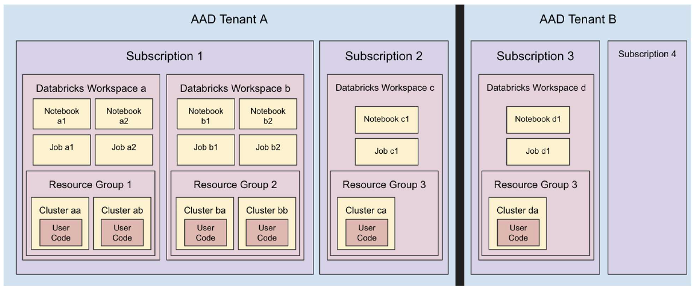
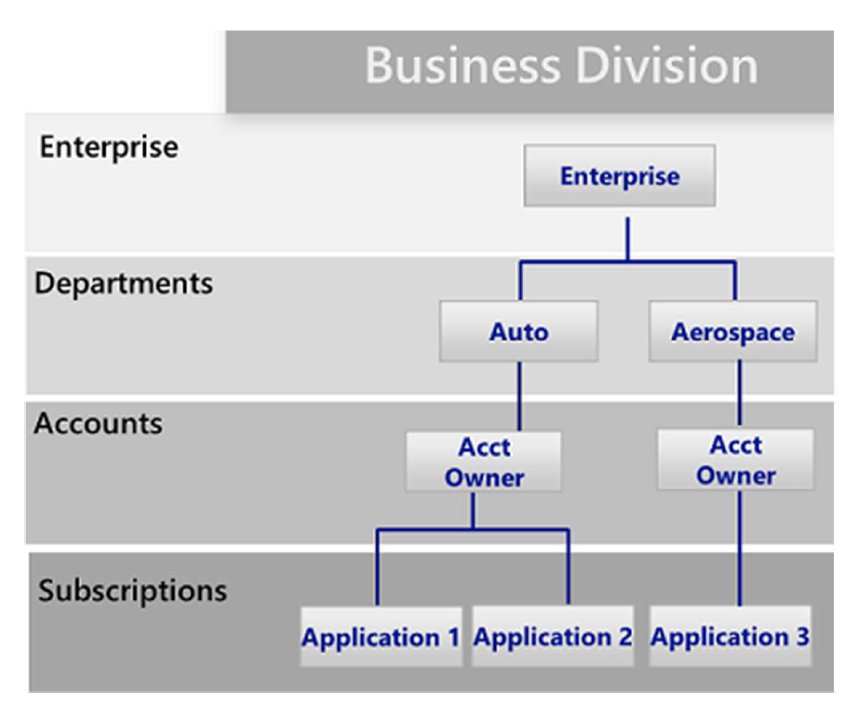
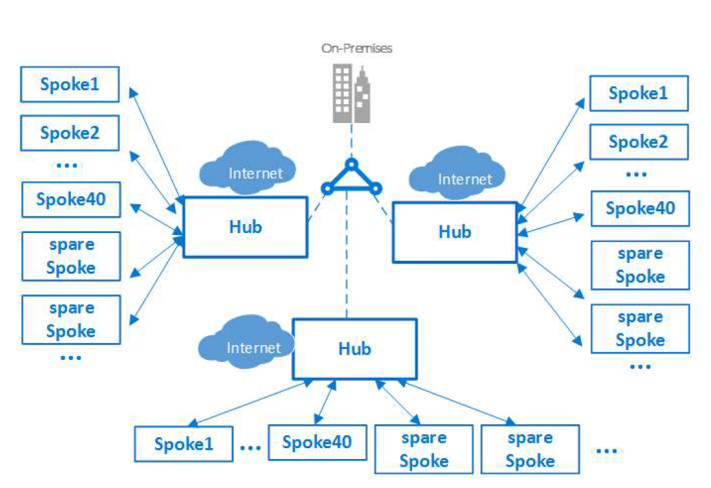
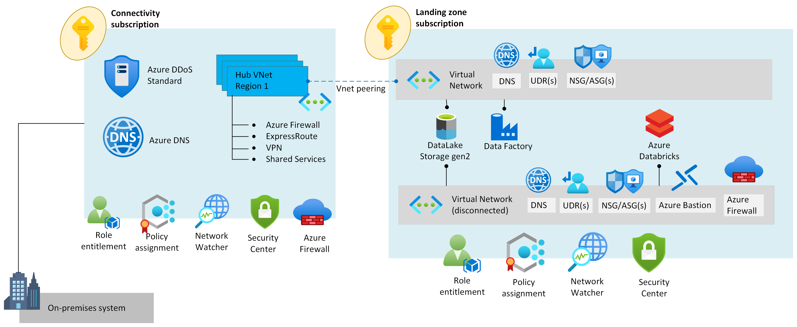
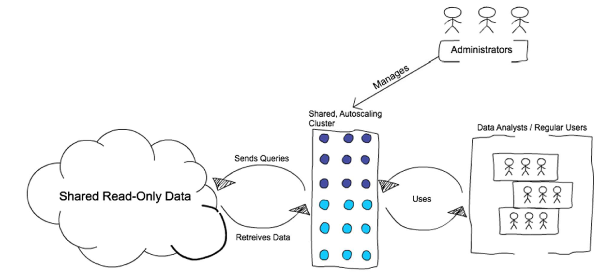
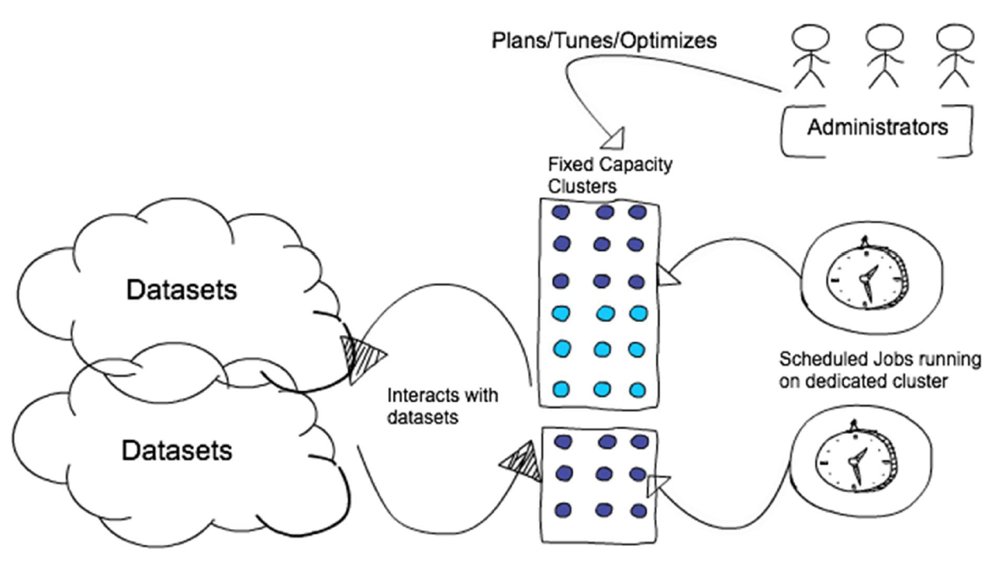
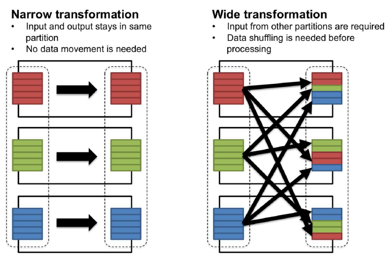
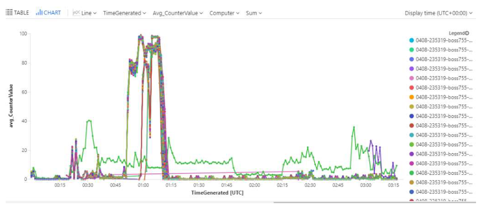

<p align="center">
    
</p>

# Azure Databricks Best Practices

Authors: 
* Dhruv Kumar, Senior Solutions Architect, Databricks 
* Premal Shah, Azure Databricks PM, Microsoft
* Bhanu Prakash, Azure Databricks PM, Microsoft

Written by: Priya Aswani, WW Data Engineering & AI Technical Lead 

# Table of Contents

- [Introduction](#Introduction)
- [Scalable ADB Deployments: Guidelines for Networking, Security, and Capacity Planning](#Scalable-ADB-Deployments:-Guidelines-for-Networking,-Security,-and-Capacity-Planning)
  * [Azure Databricks 101](#Azure-Databricks-101)
  * [Map Workspaces to business divisions](#Map-Workspaces-to-business-divisions)
  * [Deploy Workspaces in multiple subscriptions to honor Azure capacity limits](#Deploy-Workspaces-in-multiple-subscriptions-to-honor-Azure-capacity-limits)
    + [Azure Databricks Workspace limits](#Azure-Databricks-Workspace-limits)
    + [Azure subscription limits](#Azure-subscription-limits)
  * [Consider isolating each Workspace in its own VNet](#Consider-isolating-each-Workspace-in-its-own-VNet)
  * [Select the largest VNet CIDR](#Select-the-largest-VNet-CIDR)
  * [Azure Databricks deployment with limited private IP addresses](#Azure-Databricks-deployment-with-limited-private-IP-addresses)
  * [Do not store any production data in default DBFS folders](#Do-not-store-any-production-data-in-default-DBFS-folders)
  * [Always hide Secrets in a Key Vault](#Always-hide-Secrets-in-a-Key-Vault)
- [Deploying applications on ADB: Guidelines for selecting, sizing, and optimizing Clusters' performance](#Deploying-applications-on-ADB:-Guidelines-for-selecting,-sizing,-and-optimizing-Clusters'-performance)
  * [Support interactive analytics using shared High Concurrency Clusters](#Support-interactive-analytics-using-shared-High-Concurrency-Clusters)
   * [Support batch ETL workloads with single user ephemeral standard Clusters](#support-batch-ETL-workloads-with-single-user-ephemeral-standard-Clusters)
   * [Favor Cluster-scoped Init Scripts over Global and Named scripts](#Favor-Cluster-scoped-Init-Scripts-over-Global-and-Named-scripts)
   * [Use Cluster log delivery feature to manage logs](#Use-Cluster-log-delivery-feature-to-manage-logs)
   * [Choose Cluster VMs to match workload class](#Choose-Cluster-VMs-to-match-workload-class)
   * [Arrive at correct Cluster size by iterative performance testing](#Arrive-at-correct-cluster-size-by-iterative-performance-testing)
   * [Tune shuffle for optimal performance](#Tune-shuffle-for-optimal-performance)
   * [Partition your data](#Partition-your-data)
- [Running ADB applications smoothly: Guidelines on observability and monitoring](#Running-ADB-applications-smoothly:-Guidelines-on-observability-and-monitoring)
  * [Collect resource utilization metrics across Azure Databricks Clusters in a Log Analytics workspace](#Collect-resource-utilization-metrics-across-Azure-Databricks-Clusters-in-a-Log-Analytics-workspace)
   + [Querying VM metrics in Log Analytics once you have started the collection using the above document](#Querying-VM-metrics-in-Log-Analytics-once-you-have-started-the-collection-using-the-above-document)
- [Cost management, chargeback, and analysis](#Cost-management,-chargeback,-and-analysis)
- [Appendix A](#Appendix-A)
  * [Installation process to enable capturing VM metrics in Log Analytics](#Installation-process-to-enable-capturing-VM-metrics-in-Log-Analytics)
    + [Step 1 - Create a Log Analytics workspace](#Step-1---Create-a-Log-Analytics-workspace)
    + [Step 2 - Get Log Analytics workspace credentials](#Step-2---Get-Log-Analytics-workspace-credentials)
    + [Step 3 - Configure data collection in Log Analytics workspace](#Step-3---Configure-data-collection-in-Log-Analytics-workspace) 
    + [Step 4 - Configure the Init Script](#Step-4---Configure-the-Init-Script) 
    + [Step 5 - View collected data via Azure Portal](#Step-5---View-collected-data-via-Azure-Portal)
    + [References](#References)
  * [Access patterns with Azure Data Lake Storage Gen2](#Access-patterns-with-Azure-Data-Lake-Storage-Gen2)

> ***"A designer knows he has achieved perfection not when there is nothing left to add, but when there is nothing left to take away."*** --Antoine de Saint-Exupéry

## Introduction

Planning, deploying, and running Azure Databricks (ADB) at scale requires one to make many architectural decisions.

While each ADB deployment is unique to an organization's needs, we have found that some patterns are common across most successful ADB projects. Unsurprisingly, these patterns are also in-line with modern cloud-centric development best practices.

This short guide summarizes these patterns into prescriptive and actionable best practices for Azure Databricks. We follow a logical path of planning the infrastructure, provisioning the workspaces, developing Azure Databricks applications, and finally, running Azure Databricks in production.

The intended audience of this guide is system architects, field engineers, and development teams of customers, Microsoft, and Databricks. Since the Azure Databricks product goes through fast iteration cycles, we have avoided recommendations based on roadmap or Private Preview features.

Our recommendations should apply to a typical Fortune 500 enterprise with at least intermediate level of Azure and Databricks knowledge. We have also classified each recommendation according to its likely impact on solution's quality attributes. Using the **Impact** factor, you can weigh the recommendation against other competing choices. Example: if the impact is classified as *Very High*, the implications of not adopting the best practice can have a significant impact on your deployment.

**Important Note**: This guide is intended to be used in conjunction with the detailed [Azure Databricks Documentation](https://docs.microsoft.com/en-us/azure/databricks/).

## Scalable ADB deployments: guidelines for networking, security, and capacity planning

Azure Databricks (ADB) deployments for very small organizations, proof of concept (PoC) applications, or for personal education hardly require any planning. One can spin up a Workspace using Azure Portal in a matter of minutes, create a Notebook, and start writing code.

Enterprise-grade large-scale deployments are a different story altogether. Some upfront planning is necessary to manage Azure Databricks deployments across large teams. In particular, you need to understand:

  * Networking requirements of Azure Databricks
  * The number and the type of Azure networking resources required to launch clusters
  * Relationship between Azure and Databricks jargon: Subscription, VNets, Subnets, Workspaces, Clusters, etc.
  * Overall Capacity Planning process: where to begin, what to consider?


Let’s start with a short Azure Databricks 101 and then discuss some best practices for scalable and secure deployments.

## Azure Databricks 101

ADB is a Big Data analytics service. Being a Cloud Optimized managed [PaaS](https://azure.microsoft.com/en-us/overview/what-is-paas/)  offering, it is designed to hide the underlying distributed systems and networking complexity as much as possible from the end user. It is backed by a team of support staff who monitor its health, debug tickets filled via Azure, etc. This allows ADB users to focus on developing value-generating apps rather than stressing over infrastructure management.

You can deploy ADB using Azure Portal or using [ARM templates](https://docs.microsoft.com/en-us/azure/azure-resource-manager/resource-group-overview#template-deployment). One successful ADB deployment produces exactly one [Workspace](https://docs.microsoft.com/en-us/azure/databricks/workspace/), a space where users can log in and author analytics apps. It comprises of [Notebooks](https://docs.microsoft.com/en-us/azure/databricks/notebooks/), [Tables](https://docs.microsoft.com/en-us/azure/databricks/data/tables), [Clusters](https://docs.microsoft.com/en-us/azure/databricks/clusters/), [DBFS storage](https://docs.microsoft.com/en-us/azure/databricks/data/databricks-file-system), etc. More importantly, Workspace is a fundamental isolation unit in Databricks. All workspaces are completely isolated from each other.

Each Workspace is identified by a globally unique 53-bit number, called ***Workspace ID*** or ***Organization ID***. The URL that a customer sees after logging in always uniquely identifies the Workspace they are using. It takes the following form: 

*https://adb-WorkspaceId.RandomNumber.azuredatabricks.net*

Example: *https://adb-1234567890123456.10.azuredatabricks.net*

Azure Databricks uses [Azure Active Directory (AAD)](https://docs.microsoft.com/en-us/azure/active-directory/fundamentals/active-directory-whatis) as the exclusive Identity Provider and there is a seamless out-of-the-box integration between them. This makes ADB tightly integrated with Azure just like its other core services. Any AAD member assigned to the Owner or Contributor role can deploy Databricks and is automatically added to the ADB members list upon first login. If a user is not a member or guest of the Active Directory tenant, they cannot login to the workspace. Granting access to a user in another tenant (for example, if contoso.com wants to collaborate with adventure-works.com users) does work because those external users are added as guests to the tenant hosting Azure Databricks.

Azure Databricks comes with its own user management interface. You can create [Users](https://docs.microsoft.com/en-us/azure/databricks/administration-guide/users-groups/users) and [Groups](https://docs.microsoft.com/en-us/azure/databricks/administration-guide/users-groups/groups) in a Workspace and assign them certain privileges. While users in AAD are equivalent to Databricks Users, by default AAD roles have no relationship with Groups created inside ADB, unless you use [SCIM](https://docs.microsoft.com/en-us/azure/databricks/administration-guide/users-groups/scim/) for provisioning Users and Groups. With SCIM, you can import both Groups and Users from AAD into Azure Databricks, and the synchronization is automatic after the initial import. ADB also has a special group called ***admins***, not to be confused with AAD’s role [Admin](https://docs.microsoft.com/en-us/azure/active-directory/roles/permissions-reference).

The first user to login and initialize the Workspace is the workspace ***owner***, and they are automatically assigned to the Databricks ***admins*** group. This person can invite other users to the Workspace, add them as admins, create Groups, etc. The ADB logged-in user’s identity is provided by AAD and shows up under the user menu in the Workspace:

<p align="left">
  
</p>

*Figure 1: Databricks user menu*

Multiple Clusters can exist within a Workspace, and there is a one-to-many mapping between Subscriptions and Workspaces, and further, between Workspaces and Clusters. 



*Figure 2: Relationship Between AAD, Workspaces, Resource Groups, and Clusters*

With this basic understanding let’s discuss how to plan a typical ADB deployment. We first grapple with the issue of dividing Workspaces and assign them to users and teams.
  

## Map Workspaces to business divisions
*Impact: Very High*

How many Workspaces do you need to deploy? The answer to this question depends a lot on your organization’s structure. We recommend that you assign Workspaces based on a related group of people working together collaboratively. This also helps in streamlining your access control matrix within your Workspace (folders, notebooks etc.) and also across all your resources that the Workspace interacts with (storage, related data stores such as Azure SQL DB, Azure Synapse Analytics etc.). This type of division scheme is also known as the [Business Unit Subscription](https://docs.microsoft.com/en-us/azure/cloud-adoption-framework/decision-guides/subscriptions/) design pattern and it aligns well with Databricks' chargeback model.


<p align="left">
  
</p>

*Figure 3: Business Unit Subscription Design Pattern*

## Deploy Workspaces in multiple subscriptions to honor Azure capacity limits
*Impact: Very High*

Customers commonly partition Workspaces based on teams or departments and arrive at that division naturally. But it is also important to partition in order to adhere to Azure Subscription and ADB Workspace limits.

### Azure Databricks Workspace limits
Azure Databricks is a multitenant service and to provide fair resource sharing to all regional customers, it imposes limits on API calls. These limits are expressed at the Workspace level and are due to internal ADB components. For instance, you can only run up to 1000 concurrent [Jobs](https://docs.microsoft.com/en-us/azure/databricks/jobs) in a Workspace. Beyond that, ADB will deny your job submissions. There are also other limits such as max hourly Job submissions, max Notebooks, etc.
    
Key workspace limits are:

  * The maximum number of jobs that a Workspace can create in an hour is **5000**
  * At any time, you cannot have more than **1000 Jobs** simultaneously running in a Workspace
  * There can be a maximum of **145 Notebooks or execution contexts** attached to a Cluster
  * The maximum number secret scopes per Workspace is **100**

### Azure subscription limits
Next, there are [Azure limits](https://docs.microsoft.com/en-us/azure/azure-subscription-service-limits) to consider since ADB deployments are built on top of the Azure infrastructure. 

Key Azure limits are:
  * Storage accounts per region per subscription: **250**
  * Maximum egress for general-purpose v2 and Blob storage accounts (all regions): **50 Gbps**
  * VMs per subscription per region: **25,000**
  * Resource groups per subscription: **980**


These limits are at this point in time and might change going forward. Some of them can also be increased if needed. For more help in understanding the impact of these limits or options of increasing them, please contact Microsoft or Databricks technical architects.

> ***Due to scalability reasons, we highly recommend separating the production and dev/stage environments into separate subscriptions.***

## Consider isolating each Workspace in its own VNet
*Impact: Low*

While you can deploy more than one Workspace in a VNet by keeping the associated subnet pairs separate from other Workspaces, we recommend that you only deploy one Workspace in any VNet. Doing this perfectly aligns with the ADB's Workspace-level isolation model. Most often organizations consider putting multiple Workspaces in the same VNet so that they could all share some common networking resource, such as custom DNS server, which is also placed in the same VNet because the private address space in a VNet is shared by all resources. You can easily achieve the same while keeping the Workspaces separate by following the [hub and spoke model](https://docs.microsoft.com/en-us/azure/architecture/reference-architectures/hybrid-networking/hub-spoke) and using VNet Peering to extend the private IP space of the workspace VNet. Here are the steps: 
1. Deploy each Workspace in its own spoke VNet.
2. Put all the common networking resources in a central hub VNet, such as your custom DNS server.  
3. Join the Workspace spokes with the central networking hub using [VNet Peering](https://docs.microsoft.com/en-us/azure/databricks/administration-guide/cloud-configurations/azure/vnet-peering)

More information: [Azure Virtual Datacenter: a network perspective](https://docs.microsoft.com/en-us/azure/cloud-adoption-framework/reference/networking-vdc#topology)

<p align="left">
  
</p>

*Figure 4: Hub and Spoke Model*

## Select the largest VNet CIDR
*Impact: Very High*

> ***This recommendation applies only if you are deploying Azure Databricks in your own VNet (also known as VNet injection).***  

Recall that each Workspace can contain multiple Clusters. The total capacity of Clusters in a given Workspace is a function of the masks used for the Workspace's enclosing VNet and the pair of subnets associated with each Cluster in the Workspace. The masks can be changed if you use the [VNet injection](https://docs.microsoft.com/en-us/azure/databricks/administration-guide/cloud-configurations/azure/vnet-inject) feature as it gives you more control over the networking layout.  It is important to understand this relationship for accurate capacity planning.   

  * Each cluster node requires 1 Public IP and 2 Private IPs
  * These IPs are logically grouped into 2 subnets named **public** and **private**
  * For a desired cluster size of X: number of Public IPs = X, number of Private IPs = 4X
  * The 4X requirement for Private IPs is due to the fact that for each deployment:
    + Half of address space is reserved for future use
    + The other half is equally divided into the two subnets: private and public
  * The size of private and public subnets thur determines total number of VMs available for clusters 
    + /22 mask is larger than /23, so setting private and public to /22 will have more VMs available for creating clusters, than say /23 or below
   * But, because of the address space allocation scheme, the size of private and public subnets is constrained by the VNet’s CIDR
   * The allowed values for the enclosing VNet CIDR are from /16 through /24
   * The private and public subnet masks must be:
     + Equal
     + At least two steps down from enclosing VNet CIDR mask
     + Must be greater than /26
    
With this info, we can quickly arrive at the table below, showing how many nodes one can use across all clusters for a given VNet CIDR. It is clear that selection of VNet CIDR has far reaching implications in terms of maximum cluster size.   

| Enclosing VNet CIDR's mask where ADB Workspace is deployed | Allowed masks on private and public subnets (should be equal)| Max number of nodes across all Clusters in a Workspace, assuming higher subnet mask is chosen|
| ---| ---| ---|
| /16| /17 through /26| 32766|
| /17| /18 through /26| 16382|
| /18| /19 through /26| 8190|
| /19| /20 through /26| 4094|
| /20| /21 through /26| 2046|
| /21| /22 through /26| 1022|
| /22| /23 through /26| 510|
| /23| /24 through /26| 254|
| /24| /25 or /26| 126|

*Table 1: VNet size implications for Cluster size*

# Azure Databricks deployment with limited private IP addresses 
*Impact: High*

Depending where data sources are located, Azure Databricks can be deployed in a connected or disconnected scenario. In a connected scenario, Azure Databricks must be able to directly reach data sources located in Azure VNets or on-premises locations. In a disconnected scenario, data can be copied to a storage platform (such as an Azure Data Lake Storage account), to which Azure Databricks can be connected to using mount points. 
>***This section will cover a scenario to deploy Azure Databricks when there are limited private IP addresses and Azure Databricks can be configured to access data using mount points (disconnected scenario).***

Many multi-national enterprise organizations are building platforms in Azure, based on the hub and spoke network architecture, which is a model that maps to the recommended Azure Databricks deployments, which is to deploy only one workspace in any VNet by implementing the hub and spoke network architecture. Workspaces are deployed on the spokes, while shared networking and security resources such as ExpressRoute connectivity or DNS infrastructure is deployed in the hub.

Customer who have exhausted (or are near to exhaust) RFC1918 IP address ranges, have to optimize address space for spoke VNets, and may only be able to provide small VNets for most cases (/25 or smaller), and only in exceptional cases they may provide a larger VNet (such as a /24).

As the smallest Azure Databricks deployment requires a /24 VNet, such customers require an alternative solution, so that the business can deploy one or multiple Azure Databricks clusters across multiple VNets (as required by the business), but also, they should be able to create larger clusters, which would require larger VNet address space. 

A recommended Azure Databricks implementation, which would ensure minimal RFC1918 addresses are used, while at the same time, would allow the business users to deploy as many Azure Databricks clusters as they want and as small or large as they need them, consist on the following environments within the same Azure subscription as depicted in the picture below:

<p align="center">
  
</p>

*Figure 5: Network Topology*

As the diagram depicts, the business application subscription where Azure Databricks will be deployed, has two VNets, one that is routable to on-premises and the rest of the Azure environment (this can be a small VNet such as /26), and includes the following Azure data resources: Azure Data Factory and ADLS Gen2 (via Private Endpoint). 

> ***Note: While we use Azure Data Factory on this implementation, any other service that can perform similar functionality could be used.***

The other VNet is fully disconnected and is not routable to the rest of the environment, and on this VNet Azure Databricks and optionally Azure Bastion (to be able to perform management via jumpboxes) is deployed, as well as a Private Endpoint to the ADLS Gen2 storage, so that Azure Databricks could retrieve data for ingestion. This setup is described in further details below:

**Connected (routable environment)**
* In a business application subscription, deploy a VNet with RFC1918 addresses which is fully routable in Azure and cross-premises via ExpressRoute. This VNet can be a small VNet, such as /26 or /27.
* This VNet, is connected to a central hub VNet via VNet peering to have connectivity across Azure and on-premises via ExpressRoute or VPN.
* UDR with default route (0.0.0.0/0) points to a central NVA (for example, Azure Firewall) for internet outbound traffic.
* NSGs are configured to block inbound traffic from the internet.
* Azure Data Lake (ADLS) Gen2 is deployed in the business application subscription.
* A Private Endpoint is created on the VNet to make ADLS Gen 2 storage accessible from on-premises and from Azure VNets via a private IP address.
* Azure Data Factory will be responsible for the process of moving data from the source locations (other spoke VNets or on-premises) into the ADLS Gen2 store (accessible via Private Endpoint).
* Azure Data Factory (ADF) is deployed on this routable VNet
    * Azure Data Factory components require a compute infrastructure to run on and this is referred to as Integration Runtime. In the mentioned scenario, moving data from on-premises data sources to Azure Data Services (accessible via Private Endpoint), it is required a Self-Hosted Integration Runtime.
    * The Self-Hosted Integration Runtime needs to be installed on an Azure Virtual Machine inside the routable VNet in order to allow Azure Data Factory to communicate with the source data and destination data.
    * Considering this, Azure Data Factory only requires 1 IP address (and maximum up to 4 IP addresses) in the VNet (via the integration runtime). 


**Disconnected (non-routable environment)**
* In the same business application subscription, deploy a VNet with any RFC1918 address space that is desired by the application team (for example, 10.0.0.0/16)
* This VNet is not going to be connected to the rest of the environment. In other words, this will be a disconnected and fully isolated VNet.
* This VNet includes 3 required and 3 optional subnets:
    * 2x of them dedicated exclusively to the Azure Databricks Workspace (private-subnet and public-subnet)
    * 1x which will be used for the private link to the ADLS Gen2 
    * (Optional) 1x for Azure Bastion
    * (Optional) 1x for jumpboxes
    * (Optional but recommended) 1x for Azure Firewall (or other network security NVA). 
* Azure Databricks is deployed on this disconnected VNet.
* Azure Bastion is deployed on this disconnected VNet, to allow Azure Databricks administration via jumpboxes.
* Azure Firewall (or another network security NVA) is deployed on this disconnected VNet to secure internet outbound traffic.
* NSGs are used to lockdown traffic across subnets.
* 2x Private Endpoints are created on this disconnected VNet to make the ADLS Gen2 storage accessible for the Azure Databricks cluster:
    * 1x private endpoint having the target sub-resource *blob*
    * 1x private endpoint having the target sub-resource *dfs*
* Databricks integrates with ADLS Gen2 storage for data ingestion


## Do not store any production data in default DBFS folders
*Impact: High*

This recommendation is driven by security and data availability concerns. Every Workspace comes with a default DBFS, primarily designed to store libraries and other system-level configuration artifacts such as [Init Scripts](https://docs.microsoft.com/en-us/azure/databricks/clusters/init-scripts). You should not store any production data in it, because:
1. The lifecycle of default DBFS is tied to the Workspace. Deleting the Workspace will also delete the default DBFS and permanently remove its contents.
2. One cannot restrict access to this default folder and its contents.

> ***This recommendation does not apply to Blob or ADLS folders explicitly mounted as DBFS by the end user*** 

**More Information:**
[Databricks File System](https://docs.microsoft.com/en-us/azure/databricks/data/databricks-file-system)

## Always hide Secrets in a Key Vault 
*Impact: High*

It is a significant security risk to expose sensitive data such as access credentials openly in Notebooks or other places such as Job configs, init scripts, etc. You should always use a vault to securely store and access them. You can either use ADB’s [internal key vault](https://docs.microsoft.com/en-us/azure/databricks/security/secrets/secret-scopes) for this purpose or use [Azure’s Key Vault (AKV)](https://docs.microsoft.com/en-us/azure/key-vault/general/overview) service.

If using Azure Key Vault, create separate AKV-backed secret scopes and corresponding AKVs to store credentials pertaining to different data stores. This will help prevent users from accessing credentials that they might not have access to. Since access controls are applicable to the entire secret scope, users with access to the scope will see all Secrets for the AKV associated with that scope.

**More Information:**

[Create an Azure Key Vault-backed secret scope](https://docs.microsoft.com/en-us/azure/databricks/security/secrets/secret-scopes#--create-an-azure-key-vault-backed-secret-scope)

[Example of using secret in a notebook](https://docs.microsoft.com/en-us/azure/databricks/security/secrets/example-secret-workflow)

[Best practices for managing secret access control](https://docs.microsoft.com/en-us/azure/databricks/security/access-control/secret-acl)

# Deploying applications on ADB: Guidelines for selecting, sizing, and optimizing Clusters' performance

> ***"Any organization that designs a system will inevitably produce a design whose structure is a copy of the organization's communication structure."*** --Melvin Conway


After understanding how to provision the Workspaces, best practices in networking, etc., let’s put on the developer’s hat and see the design choices typically faced by them:

  * What type of Clusters should I use?
  * How many drivers and how many workers?
  * Which Azure VMs should I select?

In this chapter we will address such concerns and provide our recommendations, while also explaining the internals of Databricks clusters and associated topics. Some of these ideas seem counterintuitive but they will all make sense if you keep these important design attributes of the ADB service in mind:

1. **Cloud optimized:** Databricks is a product built exclusively for cloud environments, like Azure. No on-prem deployments currently exist. 

It assumes certain features are provided by the underlying cloud platform, is designed keeping Cloud best practices, and conversely, provides Cloud-friendly features.


2. **Platform/Software as a Service abstraction:** ADB sits somewhere between the PaaS and SaaS ends of the spectrum, depending on how you use it. In either case ADB is designed to hide infrastructure details as much as possible so the user can focus on application development. It is
not, for example, an IaaS offering exposing the guts of the OS Kernel to you.
3. **Managed service:** ADB guarantees a 99.95% uptime SLA. There’s a large team of dedicated staff members who monitor various aspects of its health and get alerted when something goes wrong. It is run like an always-on website and Microsoft and Databricks system operations team strives to minimize any downtime.

These three attributes make ADB very different than other Spark platforms such as HDP, CDH, Mesos, etc. which are designed for on-prem datacenters and allow the user complete control over the hardware. The concept of a Cluster is therefore very unique in Azure Databricks. Unlike YARN or Mesos clusters, which are just a collection of worker machines waiting for an application to be scheduled on them, Clusters in ADB come with a pre-configured Spark application. ADB submits all subsequent user requests
like Notebook commands, SQL queries, Java jar Jobs, etc. to this primordial app for execution. Under the covers Databricks clusters use the lightweight Spark Standalone resource allocator. 


When it comes to taxonomy, ADB clusters are divided along the notions of “type” and “mode.” There are two ***types*** of ADB clusters, according to how they are created. Clusters created using UI and [Clusters API](https://docs.azuredatabricks.net/api/latest/clusters.html)  are called Interactive Clusters, whereas those created using [Jobs API](https://docs.azuredatabricks.net/api/latest/jobs.html) are called Jobs Clusters. Further, each Cluster can be of three ***modes***: Standard, High Concurrency, or Single Node. With the exception of Single Node Clusters, regardless of type or mode, all Clusters in Azure Databricks can automatically scale to match the workload, using a feature known as [Autoscaling](https://docs.microsoft.com/en-us/azure/databricks/clusters/configure#--cluster-size-and-autoscaling).

| | Standard Mode| High Concurrency Mode| Single Node Mode|
| ---| ---| ---| ---|
| Targeted User| Data Engineers| Data Scientists, Business Analysts| Business Analysts, first-time Spark users|
| Languages| Scala, Java, SQL, Python, R| SQL, Python, R| Scala, Java, SQL, Python, R|
| Best Use| Batch Jobs for ETL| Data Exploration| Ligthweight data exploration|
| Security Model| Single User| Multi User| Single User|
| Isolation| Medium| High| Low|
| Table-level Security| No| Yes| No|
| Query Preemption| No| Yes| No|
| AAD Passthrough| Yes| Yes| Yes|

*Table 2: Cluster modes and their characteristics*

## Support interactive analytics using shared High Concurrency Clusters
*Impact: Medium*

There are three steps for supporting interactive workloads on ADB:
 1. Deploy a shared Cluster instead of letting each user create their own Cluster.
 2. Create the shared Cluster in High Concurrency mode instead of Standard mode.
 3. Configure security on the shared High Concurrency cluster, using **one** of the following options:
     * Turn on [AAD Credential Passthrough](https://docs.microsoft.com/en-us/azure/databricks/security/credential-passthrough/adls-passthrough) if you’re using ADLS
     * Turn on [Table Access Control](https://docs.microsoft.com/en-us/azure/databricks/security/access-control/table-acls/table-acl) for all other stores

To understand why, let’s quickly see how interactive workloads are different from batch workloads:

| Workload \ Attribute| Interactive| Batch|
| ---| ---| ---|
| Optimization Metric: What matters to end users?| Low execution time: low individual query latency.| Maximizing Jobs executed over some time period: high throughput.|
| Submission Pattern: How is the work submitted to ADB?| By users manually. Either executing Notebook queries or exploring data in a connected BI tool.| Automatically submitted by a scheduler or external workflow tool without user input.|
| Cost: Are the workload's demands predictable?| No. Understanding data via interactive exploration requires multitude of queries impossible to predict ahead of time.| Yes, because a Job's logic is fixed and does not change with each run.|

*Table 3: Batch vs. Interactive workloads*

Because of these differences, supporting Interactive workloads entails minimizing cost variability and optimizing for latency over throughput, while providing a secure environment. These goals are satisfied by shared High Concurrency clusters with Table access controls or AAD Passthrough turned on (in case of ADLS):

  1. **Minimizing cost:** By forcing users to share an Autoscaling Cluster you have configured with maximum node count, rather than say, asking them to create a new one for their use each time they log in, you can control the total cost easily. The max cost of shared Cluster can be calculated by assuming it is running X hours at maximum size with the particular VMs. It is difficult to achieve this if each user is given free reign over creating Clusters of arbitrary size and VM type.
  
  2. **Optimizing for latency:** Only High Concurrency Clusters have features which allow queries from different users share Cluster resources in a fair, secure manner. High Concurrency Clusters come with [Query Watchdog](https://docs.microsoft.com/en-us/azure/databricks/spark/latest/spark-sql/query-watchdog), a process which keeps disruptive queries in check by automatically pre-empting rogue queries, limiting the maximum size of output rows returned, etc.
  
  3. **Security:** Table Access Control feature is only available in High Concurrency mode and needs to be turned on so that users can limit access to their database objects (tables, views, functions, etc.) created on the shared Cluster. In case of ADLS, we recommend restricting access using the AAD Credential Passthrough feature instead of Table Access Controls.

> ***If you are using ADLS, we recommend AAD Credential Passthrough instead of Table Access Control for easy manageability.*** 



*Figure 6: Interactive clusters*

## Support batch ETL workloads with single user ephemeral standard Clusters
*Impact: Medium*

Unlike Interactive workloads, logic in batch Jobs is well defined and their Cluster resource requirements are known *a priori*. Hence to minimize cost, there is no reason to follow the shared Cluster model and we recommend letting each Job create a separate Cluster for its execution. Thus, instead of submitting batch ETL Jobs to a Cluster already created from ADB’s UI, submit them using the Jobs APIs. These APIs automatically create new Clusters to run Jobs and also terminate them after running it. We call this the **Ephemeral Job Cluster** pattern for running Jobs because the Clusters short life is tied to the Job lifecycle.

Azure Data Factory uses this pattern as well - each Job ends up creating a separate Cluster since the underlying call is made using the [Runs Submit Jobs API](https://docs.microsoft.com/en-us/azure/databricks/dev-tools/api/latest/jobs#--runs-submit).



*Figure 7: Ephemeral Job cluster*

Just like the previous recommendation, this pattern will achieve general goals of minimizing cost, improving the target metric (throughput), and enhancing security by:

1. **Enhanced security:** ephemeral Clusters run only one Job at a time, so each executor’s JVM runs code from only one user. This makes ephemeral Clusters more secure than shared Clusters for Java and Scala code.
2. **Lower cost:** if you run Jobs on a Cluster created from ADB’s UI, you will be charged at the higher Interactive DBU rate. The lower Data Engineering DBUs are only available when the lifecycle of Job and Cluster are same. This is only achievable using the Jobs APIs to launch Jobs on ephemeral Clusters.
3. **Better throughput:** Cluster’s resources are dedicated to one Job only, making the Job finish faster than while running in a shared environment.

For very short duration Jobs (< 10 min), the Cluster launch time (~ 7 min) adds a significant overhead to the total execution time. Historically this forced users to run short Jobs on existing Clusters created in the UI -- a costlier and less secure alternative. To fix this, ADB introduced a feature called [Instance Pools](https://docs.microsoft.com/en-us/azure/databricks/clusters/instance-pools/) that brings down Cluster launch time to 30 seconds or less by maintaining a set of idle, ready-to-use instances.

## Favor Cluster-scoped Init Scripts over Global and Named scripts
*Impact: High*

[Init Scripts](https://docs.microsoft.com/en-us/azure/databricks/clusters/init-scripts) provide a way to configure Cluster’s nodes and can be used in the following modes:

  1. **Global:** by placing the init script in `/databricks/init` folder, you force the script’s execution every time any Cluster is created or restarted by users of the Workspace.
  2. **Legacy global (deprecated):** runs on every Cluster in a Workspace, but is less secure than *Global*. Users are advised to migrate to *Global* if still using the legacy version.  
  3. **Cluster-named (deprecated):** you can limit the init script to run only on for a specific Cluster’s creation and restarts by placing it in `/databricks/init/<cluster_name>` folder.
  4. **Cluster-scoped:** in this mode the init script is not tied to any Cluster by its name and its automatic execution is not a virtue of its DBFS location. Rather, you specify the script in Cluster’s configuration by either writing it directly in the Cluster configuration UI or storing it on DBFS and specifying the path in [Cluster Create API](https://docs.microsoft.com/en-us/azure/databricks/clusters/init-scripts#cluster-scoped-init-script). Any location under DBFS `/databricks` folder except `/databricks/init` can be used for this purpose, such as: `/databricks/<my-directory>/set-env-var.sh`
 
You should treat init scripts with *extreme* caution because they can easily lead to intractable Cluster launch failures. If you really need them, please use the Cluster-scoped execution mode as much as possible because:

  1. ADB executes the script’s body in each cluster node. Thus, a successful Cluster launch and subsequent operation is predicated on all nodal init scripts executing in a timely manner without any errors and reporting a zero exit code. This process is highly error prone, especially for scripts downloading artifacts from an external service over unreliable and/or misconfigured networks.
  2. Because Global, Legacy global, and Cluster-named init scripts execute automatically due to their placement in a special DBFS location, it is easy to overlook that they could be causing a Cluster to not launch. By specifying the init script in the configuration, there is a higher chance that you will consider them while debugging launch failures.
 
 ## Use Cluster log delivery feature to manage logs 
*Impact: Medium*

By default, Cluster logs are sent to default DBFS but you should consider sending the logs to a blob store location under your control using the [Cluster Log Delivery](https://docs.microsoft.com/en-us/azure/databricks/clusters/configure#cluster-log-delivery) feature. The Cluster logs contain information emitted by user code, as well as Spark framework’s Driver and Executor logs. Sending them to a blob store controlled by yourself is recommended over default DBFS location because:
  1. ADB’s automatic 30-day default DBFS log purging policy might be too short for certain compliance scenarios. A blob store loction in your subscription will be free from such policies.
  2. You can ship logs to other tools only if they are present in your storage account and a resource group governed by you. The root DBFS, although present in your subscription, is launched inside a Microsoft Azure managed resource group and is protected by a read lock. Because of this lock the logs are only accessible by privileged Azure Databricks framework code. However, constructing a pipeline to ship the logs to downstream log analytics tools requires logs to be in a lock-free location first.

## Choose Cluster VMs to match workload class
*Impact: High*

To allocate the right amount and type of Cluster resource for a Job, we need to understand how different types of Jobs demand different types of Cluster resources.

   * **Machine Learning** - To train machine learning models it is usually required to cache all of the data in memory. Consider using memory optimized VMs so that the Cluster can take advantage of the RAM cache. You can also use storage optimized instances for very large datasets. To size the Cluster, take a % of the data set → cache it → see how much memory it used → extrapolate that to the rest of the data.

  * **Streaming** - You need to make sure that the processing rate is just above the input rate at peak times of the day. Depending on peak input rate times, consider compute optimized VMs for the Cluster to make sure processing rate is higher than your input rate.
  
  * **ETL** - In this case, data size and deciding how fast a Job needs to complete will be a leading indicator. Spark does not always require data to be loaded into memory in order to execute transformations, but you will at the very least need to see how large the task sizes are on shuffles and compare that to the task throughput you would like. To analyze the performance of these Jobs start with basics and check if the Job is bound by CPU, network, or local I/O, and go from there. Consider using a general purpose VM for these Jobs.
  * **Interactive/Development workloads** - The ability for a Cluster to dynamically adapt to load is most important for these types of scenarios. In this the [Autoscaling feature](https://docs.microsoft.com/en-us/azure/databricks/clusters/configure#autoscaling) will be your best friend in managing the cost of the infrastructure.

## Arrive at correct Cluster size by iterative performance testing
*Impact: High*

It is impossible to predict the correct Cluster size without developing the application because Spark and Azure Databricks use numerous techniques to improve Cluster utilization. The broad approach you should follow for sizing is:

1. Develop on a medium sized Cluster of 2-8 nodes, with VMs matched to workload class as explained earlier.
2. After meeting functional requirements, run end to end test on larger representative data while measuring CPU, memory, and I/O used by the Cluster at an aggregate level.
3. Optimize Cluster to remove bottlenecks found in step 2
    - **CPU-bound**: add more cores by adding more nodes
    - **Network-bound**: use fewer, bigger SSD-backed machines to reduce network size and improve remote read performance
    - **Disk I/O-bound**: if Jobs are spilling to disk, use VMs with more memory

Repeat steps 2 and 3 by adding nodes and/or evaluating different VMs until all obvious bottlenecks have been addressed.

Performing these steps will help you to arrive at a baseline Cluster size which can meet SLA on a subset of data. In theory, Spark Jobs, like Jobs on other Data Intensive frameworks (Hadoop) exhibit linear scaling. For example, if it takes 5 nodes to meet SLA on a 100TB dataset and the production data is around 1PB, then prod Cluster is likely going to be around 50 nodes in size. You can use this back of the envelope calculation as a first guess to do capacity planning. However, there are scenarios where Spark Jobs do not scale linearly. In some cases this is due to large amounts of shuffle adding an exponential synchronization cost (explained next), but there could be other reasons as well. Hence, to refine the first estimate and arrive at a more accurate node count we recommend repeating this process 3-4 times on increasingly larger data set sizes, say 5%, 10%, 15%, 30%, etc. The overall accuracy of the process depends on how closely the test data matches the live workload both in type and size.

## Tune shuffle for optimal performance
*Impact: High*

A shuffle occurs when we need to move data from one node to another in order to complete a stage. Depending on the type of transformation you are doing you may cause a shuffle to occur. This happens when all the executors require seeing all of the data in order to accurately perform the action. If the Job requires a wide transformation, you can expect the Job to execute slower because all of the partitions need to be shuffled around in order to complete the Job. Eg: Group by, Distinct.

<p align="left">
  
</p>

*Figure 8: Shuffle vs. no-shuffle*

You have got two control knobs of a shuffle you can use to optimize:
  * The number of partitions being shuffled:
  `spark.conf.set("spark.sql.shuffle.partitions", 10)`
  * The amount of partitions that you can compute in parallel.
    * This is equal to the number of cores in your Cluster.

These two determine the partition size, which we recommend should be in the Megabytes to 1 Gigabyte range. If your shuffle partitions are too small, you may be unnecessarily adding more tasks to the stage. But if they are too big, you may get bottlenecked by the network.

## Partition your data
*Impact: High*

This is a broad Big Data best practice not limited to Azure Databricks, and we mention it here because it can notably impact the performance of Databricks Jobs. Storing data in partitions allows you to take advantage of partition pruning and data skipping, two very important features which can avoid unnecessary data reads. Most of the time partitions will be on a date field but you should choose your partitioning field based on the predicates most often used by your queries. For example, if you are always going to be filtering based on *Region,* then consider partitioning your data by *Region*.

   * Evenly distribute data across all partitions (date is the most common)
   * 10s of GB per partition (~10 to ~50GB)
   * Small data sets should not be partitioned
   * Beware of over partitioning
   
# Running ADB applications smoothly: Guidelines on observability and monitoring

> ***"Every program attempts to expand until it can read mail. Those programs which cannot so expand are replaced by ones which can."*** --Jamie Zawinski

By now we have covered planning for ADB deployments, provisioning Workspaces, selecting Clusters, and deploying your applications on them. Now, let's talk about how to monitor your Azure Databricks apps. These apps are rarely executed in isolation and need to be monitored along with a set of other services. Monitoring falls into four broad areas:

   1. Resource utilization (CPU/Memory/Network) across an Azure Databricks Cluster. This is referred to as VM metrics.
   2. Spark metrics which enables monitoring of Spark applications to help uncover bottlenecks 
   3. Spark application logs which enables administrators/developers to query the logs, debug issues, and investigate Job run failures. This is specifically helpful to also understand exceptions across your workloads.
   4. Application instrumentation which is native instrumentation that you add to your application for custom troubleshooting.

For the purposes of this version of the document we will focus on (1). This is the most common ask from customers. For (2) and (3) please refer to the [spark-monitoring](https://github.com/mspnp/spark-monitoring) library.

## Collect resource utilization metrics across Azure Databricks Clusters in a Log Analytics workspace
*Impact: Medium*

An important facet of monitoring is understanding the resource utilization in Azure Databricks Clusters. You can also extend this to understanding utilization across all Clusters in a Workspace. This information is useful in arriving at the correct Cluster and VM sizes. Each VM does have a set of limits (number of cores, disk throughput, network throughput) which play an important role in determining the performance profile of an Azure Databricks Job.

In order to get utilization metrics of an Azure Databricks Cluster, you can stream the VM's metrics to an Azure Log Analytics Workspace (see [Appendix A](#Appendix-A)) by installing the Log Analytics Agent on each Cluster node. Note: This could increase your Cluster startup time by a few minutes.


### Querying VM metrics in Log Analytics once you have started the collection using the above document

You can use Log Analytics directly to query the Perf data. Here is an example of a query which charts out CPU for the VMs in question for a specific Cluster ID. See [Log Analytics overview](https://docs.microsoft.com/en-us/azure/azure-monitor/log-query/log-analytics-overview) for further documentation on Log Analytics and query syntax.

```sql
Perf
| where CounterName == '% Processor Time'
| where InstanceName == '_Total'
| where Computer startswith '<your_cluster_id>'
```



*Figure 9: Example of CPU utilization graph for nodes in one Cluster.*

You can also use [Grafana plugin](https://docs.microsoft.com/en-us/azure/azure-monitor/platform/grafana-plugin) to visualize your data from Log Analytics.

## Cost management, chargeback, and analysis

This section will focus on Azure Databricks billing, tools to manage and analyze cost, and how to charge back to the team.

### Azure Databricks billing
First, it is important to understand the different workloads and tiers available with Azure Databricks. Azure Databricks is available in 2 tiers – Standard and Premium. Premium tier offers additional features on top of what is available in Standard tier. These include role-based access control for Notebooks, Jobs, and tables, audit logs, Azure AD conditional pass-through, conditional authentication, and many more. Please refer to [Azure Databricks pricing](https://azure.microsoft.com/en-us/pricing/details/databricks/) for the complete list. 

Both Premium and Standard tier come with 3 types of workloads:
 * Jobs Compute (previously called Data Engineering)
 * Jobs Light Compute (previously called Data Engineering Light)
 * All-purpose Compute (previously called Data Analytics)

The Jobs Compute and Jobs Light Compute make it easy for data engineers to build and execute Jobs, and All-purpose makes it easy for data scientists to explore, visualize, manipulate, and share data and insights interactively. Depending upon the use-case, one can also use All-purpose Compute for data engineering or automated scenarios especially if the incoming Job rate is higher. 

When you create an Azure Databricks Workspace and spin up a Cluster, below resources are consumed:

1. DBUs – A DBU is a unit of processing capability, billed on a per-second usage
2. Virtual Machines – These represent your Databricks Clusters that run the Databricks Runtime
3. Public IP Addresses – These represent the IP Addresses consumed by the Virtual Machines when the Cluster is running
4. Blob Storage – Each workspace comes with a default storage (DBFS)
5. Managed Disks
6. Bandwidth – Bandwidth charges for any data transfer

Please refer to the following table for pricing information of the respective resources:

| Service or Resource | Pricing |
| --- | --- |
| DBUs |[DBU pricing](https://azure.microsoft.com/en-us/pricing/details/databricks/) |
| VMs |[VM pricing](https://azure.microsoft.com/en-us/pricing/details/databricks/) |
| Public IP Addresses |[Public IP Addresses pricing](https://azure.microsoft.com/en-us/pricing/details/ip-addresses/) |
| Blob Storage |[Blob Storage pricing](https://azure.microsoft.com/en-us/pricing/details/storage/) |
| Managed Disks |[Managed Disk pricing](https://azure.microsoft.com/en-us/pricing/details/managed-disks/) |
| Bandwidth |[Bandwidth pricing](https://azure.microsoft.com/en-us/pricing/details/bandwidth/) |

*Table 4: Pricing of different components of Azure Databricks.*
 
In addition, if you use additional services such as Azure Cosmos DB or Azure Event Hub, as part of your end-to-end solution, then they are charged per their respective pricing plans. 

There are 2 pricing plans for Azure Databricks DBUs:

1. Pay as you go – Pay for the DBUs as you use: Refer to the pricing page for the DBU prices based on the tier. The DBU per hour price for Standard and Premium tier differs across Azure public cloud, Azure Government, and Azure China.

2. Pre-purchase or Reservations – You can get up to 37% savings over pay-as-you-go DBU when you pre-purchase Azure Databricks Units (DBU) as Databricks Commit Units (DBCU) for either 1 or 3 years. A Databricks Commit Unit (DBCU) normalizes usage from Azure Databricks workloads and tiers into to a single purchase. Your DBU usage across those workloads and tiers will draw down from the Databricks Commit Units (DBCU) until they are exhausted, or the purchase term expires.

Since, you are also billed for the VMs, you have both the above options for VMs as well:

1.	Pay as you go 
2.	[Reservations](https://azure.microsoft.com/en-us/pricing/reserved-vm-instances/)

Please see few examples of a billing for Azure Databricks with Pay as you go:

Depending on the type of workload your Cluster runs, you will either be charged for Jobs Compute, Jobs Light Compute, or All-purpose Compute workload. For example, if the Cluster runs workloads triggered by the Databricks Jobs scheduler, you will be charged for the Jobs Compute workload. If your Cluster runs interactive features such as ad-hoc commands, you will be billed for All-purpose Compute workload.

Accordingly, the pricing will be dependent on below components:

1.	DBU SKU – DBU price based on the workload and tier
2.	VM SKU – VM price based on the VM SKU
3.	DBU count – Each VM SKU has an associated DBU count. For example, D3v2 has DBU count of 0.75.
4.	Region
5.	Duration

#### Example 1: If you run Premium tier Cluster for 100 hours in East US 2 with 10 DS13v2 instances, the billing would be the following for All-purpose compute:
 * VM cost for 10 DS13v2 instances — 100 hours x 10 instances x \$0.598/hour  = \$598
 * DBU cost for All-purpose Compute workload for 10 DS13v2 instances — 100 hours x 10 instances x 2 DBU per node x \$0.55/DBU = \$1,100
 * The total cost would therefore be \$598 (VM Cost) + \$1,100 (DBU Cost) = \$1,698.

#### Example 2: If you run Premium tier Cluster for 100 hours in East US 2 with 10 DS13v2 instances, the billing would be the following for Jobs compute workload:
  * VM cost for 10 DS13v2 instances — 100 hours x 10 instances x \$0.598/hour = \$598
  * DBU cost for Jobs Compute workload for 10 DS13v2 instances — 100 hours x 10 instances x 2 DBU per node x \$0.30/DBU = \$600
  * The total cost would therefore be \$598 (VM Cost) + \$600 (DBU Cost) = \$1,198.
  
In addition to VM and DBU charges, there will be additional charges for managed disks, public IP address, bandwidth, or any other resource such as Azure Storage, Azure Cosmos DB depending on your application.

#### Azure Databricks trial
If you are new to Azure Databricks, you can also use a Trial SKU that gives you free DBUs for Premium tier for 14 days. You will still need to pay for other resources like VM, Storage etc. that are consumed during this period. After the trial is over, you will need to start paying for the DBUs. 

### Chargeback scenarios
There are 2 broad scenarios we have seen with respect to internal chargeback to different teams for sharing Databricks resources:

1. Chargeback across a single Azure Databricks Workspace: In this case, a single Workspace is shared across multiple teams and user would like to chargeback the individual teams. Individual teams would use their own Databricks Cluster and can be charged back at Cluster level.

2. Chargeback across multiple Databricks Workspace: In this case, teams use their own Workspace and would like to chargeback at Workspace level. To support these scenarios, Azure Databricks leverages [resource tags](https://docs.microsoft.com/en-us/azure/azure-resource-manager/management/tag-resources) so that the users can view the cost/usage for resources with tags. There are default tags that comes with every Cluster.

Please see below the default tags that are available with the resources:
| Resources | Default Tags |
| --- | --- |
| All-purpose Compute |Vendor, Creator, ClusterName, ClusterId |
| Jobs Compute or Jobs Light Compute |Vendor, Creator, ClusterName, ClusterId, RunName, JobId |
| Pool |Vendor, DatabricksInstancePoolId, DatabricksInstancePoolCreatorId |
| Resources created during workspace creation (Storage, Worker VNet, NSG)	| application, databricks-environment |

*Table 5: Default tags overview*

In addition to the default tags, customers can add custom tags to the resources based on how they want to charge back. Both default and custom tags are displayed on Azure bills that allows one to chargeback by filtering resource usage based on tags.

1. [Cluster Tags](https://docs.microsoft.com/en-us/azure/databricks/clusters/configure#cluster-tags): You can create custom tags as key-value pairs when you create a Cluster and Azure Databricks applies these tags to underlying Cluster resources – VMs, DBUs, Public IP Addresses, Disks. 

2. [Pool Tags](https://docs.microsoft.com/en-us/azure/databricks/clusters/instance-pools/configure#--pool-tags): You can create custom tags as key-value pairs when you create a Pool, and Azure Databricks applies these tags to underlying Pool resources – VMs, Public IP Addresses, Disks. Pool-backed Clusters inherit default and custom tags from the Pool configuration. 

3. [Workspace Tags](https://docs.microsoft.com/en-us/azure/databricks/administration-guide/account-settings/usage-detail-tags-azure): You can create custom tags as key-value pairs when you create an Azure Databricks Workspaces. These tags apply to underlying resources within the workspace – VMs, DBUs, and others. 

Please see below on how tags propagate for DBUs and VMs

1. Clusters created from pools
 * DBU Tag = Workspace Tag + Pool Tag + Cluster Tag
 * VM Tag = Workspace Tag + Pool Tag
 
2. Clusters not from Pools
 * DBU Tag = Workspace Tag + Cluster Tag
 * VM Tag = Workspace Tag + Cluster Tag

<p align="left">
  
</p>

*Figure 10: Tags propagtion hierarchy.*

These tags (default and custom) propagate to [Cost Analysis Reports](https://docs.microsoft.com/en-us/azure/cost-management-billing/costs/quick-acm-cost-analysis) that you can access in the Azure Portal. The below section will explain how to do cost/usage analysis using these tags.

### Cost/Usage analysis
The Cost Analysis report is available under Cost Management within Azure Portal. Please refer to [Cost Management](https://docs.microsoft.com/en-us/azure/cost-management-billing/costs/quick-acm-cost-analysis) section to get a detailed overview on how to use Cost Management.  


*Figure 11: Cost Analysis.*

Below example is aimed at giving a quick start to get you going on cost analysis for Azure Databricks:
  
  1.  In Azure Portal, click on Cost Management + Billing
  2.  In Cost Management, click on Cost Analysis Tab 

      
      *Figure 12: Cost Management portal.*
  3.  Choose the right billing scope that you want report for and make sure the you have Cost Management Reader permission for the that scope. 
  4.  Once selected, then you will see cost reports for all the Azure resources at that scope.
  5.  Post that you can create different reports by using the different options on the chart. For example, one of the reports you can create is 
      * Chart option as Column (stacked)
      * Granularity – Daily
      * Group by – Tag – Choose clustername or clusterid

You will see something like below where it will show the distribution of cost on a daily basis for different Clusters in your subscription or the scope that you chose in Step 3. You also have option to save this report and share it with your team.


*Figure 13: Daily cost breakdown for different Clusters.*
 
To chargeback, you can filter this report by using the tag option. For example, you can use default tag: Creator or can use own custom tag – Cost Center and chargeback based on that. 


*Figure 14: Tag filtering options in Cost Analysis.*
 
You also have option to consume this data from CSV or a native Power BI connector for Cost Management. Please see below:

1. To download this data to CSV, you can set export from Cost Management + Billing -> Usage + Charges and choose Usage Details Version 2 on the right. Refer [this](https://docs.microsoft.com/en-us/azure/cost-management-billing/reservations/understand-reserved-instance-usage-ea#download-the-usage-csv-file-with-new-data) for more details. Once downloaded, you can view the cost usage data and filter based on tags to chargeback. In the CSV, you can refer the Meter Name to get the Databricks workload consumed. In addition, this is how the other fields are represented for meters related to Azure Databricks.

   * Quantity = Number of Virtual Machines x Number of hours x DBU count
   * Effective Price = DBU price based on the SKU
   * Cost = Quantity x Effective Price
  
    
    *Figure 15: Cost Management Usage + Charges.*

2. There is a native [Cost Management Connector](https://docs.microsoft.com/en-us/power-bi/connect-data/desktop-connect-azure-cost-management) in Power BI that allows one to make powerful, customized visualization and cost/usage reports. 

    
    *Figure 16: PowerBI Cost Management integration.*

Once you connect, you can create various rich reports easily like below by choosing the right fields from the table.

Tip: To filter on tags, you will need to parse the json in Power BI. To do that, follow these steps:

  1. Go to "Query Editor" 
  2. Select the "Usage Details" table 
  3. On the right side the "Properties" tab shows the steps as 
    
     
     *Figure 17: Cost Management configuration.*
 
  4. From the menu bar go to "Add column" -> "Add custom column" 
  5. Name the column and enter the following text in the query = `"{"& [Tags] & "}"`
 
     
     *Figure 18: Cost Management appending Tags column.*
 
  6. This will create a new column of "tags" in the json format. 
  7. Now user can transform it and expand it. You can then use the different tags as columns that you wish to show in your report.

Please see some of the common views created easily using this connector below:


*Figure 19: Cost Report breakdown by Resource Group, Tags, MeterName.*
 

*Figure 20: Cost Report breakdown by Cluster, and custom tags.*


*Figure 21: Cost Report breakdown by Cluster and Metername in pie chart.*


*Figure 22: Cost Report breakdown by with resource group and Cluster including quantity.*

### Known issues/limitations
1.	Tag change propagation at Workspace level takes up to ~1 hour to apply to resources under Managed resource group.
2.	Tag change propagation at Workspace level requires Cluster restart for existing running Cluster, or Pool expansion.
3.	Cost Management at parent resource group will not show Managed RG resources consumption.
4.	Cost Management role assignments are not possible at Managed RG level. User today must have role assignment at parent resource group level or above (i.e. subscription) to show managed RG consumption.
5.	For Clusters created from Pool, only Workspace tags and Pool tags are propagated to the VMs.
6.	Tag keys and values can contain only characters from ISO 8859-1 set.
7.	Custom tag gets prefixed with x_ when it conflicts with default tag.
8.	Max of 50 tags can be assigned to Azure resource.

# Appendix A

## Installation process to enable capturing VM metrics in Log Analytics

#### Step 1 - Create a Log Analytics workspace
Please follow the instructions [here](https://docs.microsoft.com/en-us/azure/azure-monitor/learn/quick-collect-linux-computer#create-a-workspace) to create a Log Analytics workspace.

#### Step 2 - Get Log Analytics workspace credentials
Get the workspace id and key using instructions [here.](https://docs.microsoft.com/en-us/azure/azure-monitor/learn/quick-collect-linux-computer#obtain-workspace-id-and-key) Store these securely in an Azure Key Vault-backed Secret scope.

#### Step 3 - Configure data collection in Log Analytics workspace
Please follow the instructions [here.](https://docs.microsoft.com/en-us/azure/azure-monitor/learn/quick-collect-linux-computer#collect-event-and-performance-data)

#### Step 4 - Configure the Init Script
Replace *<LOG_ANALYTICS_WORKSPACE_ID>* and *<LOG_ANALYTICS_WORKSPACE_KEY>* with your own info.

```python
%python
script = """
sed -i "s/^exit 101$/exit 0/" /usr/sbin/policy-rc.d

wget https://raw.githubusercontent.com/Microsoft/OMS-Agent-for-Linux/master/installer/scripts/onboard_agent.sh

sh onboard_agent.sh \
-w <LOG_ANALYTICS_WORKSPACE_ID> \
-s <LOG_ANALYTICS_WORKSPACE_KEY> \
-d opinsights.azure.com

sudo su omsagent -c 'python /opt/microsoft/omsconfig/Scripts/PerformRequiredConfigurationChecks.py'
/opt/microsoft/omsagent/bin/service_control restart <LOG_ANALYTICS_WORKSPACE_ID>
"""

#save script to databricks file system so it can be loaded by VMs
dbutils.fs.put("/databricks/log_init_scripts/configure-omsagent.sh", script, True)
```

The above could also be used as a global init script to run automatically on all Clusters by changing the path to `/databricks/init` in that case, or as a Cluster-scoped init script with specific ones. We recommend using Cluster-scoped scripts as explained earlier in this doc.

#### Step 5 - View collected data via Azure Portal
See [this](https://docs.microsoft.com/en-us/azure/azure-monitor/learn/quick-collect-linux-computer#view-data-collected) document.

#### References
   * https://docs.microsoft.com/en-us/azure/azure-monitor/learn/quick-collect-linux-computer
   * https://github.com/Microsoft/OMS-Agent-for-Linux/blob/master/docs/OMS-Agent-for-Linux.md
   * https://github.com/Microsoft/OMS-Agent-for-Linux/blob/master/docs/Troubleshooting.md

## Access patterns with Azure Data Lake Storage Gen2
To understand the various access patterns and approaches to securing data in ADLS see the [following guidance](https://github.com/hurtn/datalake-ADLS-access-patterns-with-Databricks/blob/master/readme.md). 
